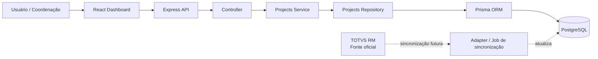
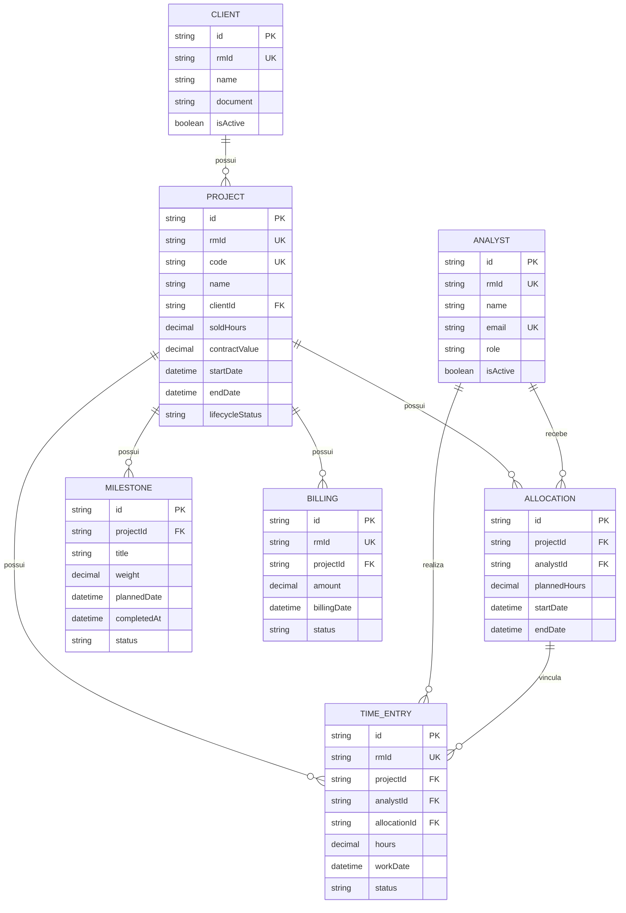

# PVT Project Dashboard

Projeto técnico desenvolvido para o processo seletivo de **Desenvolvedor Web e Infraestrutura JR** da PVT Software & Serviços.

## Objetivo

Construir um módulo de Painel de Projetos capaz de consolidar indicadores operacionais e financeiros para apoiar a coordenação na tomada de decisão.

O painel responde, por projeto:

* Quantas horas foram vendidas;
* Quantas horas foram planejadas;
* Quantas horas já foram realizadas;
* Qual é o saldo disponível de horas;
* Qual é o avanço físico;
* Qual é o avanço financeiro;
* Se o projeto está saudável, em atenção ou crítico;
* Quais regras levaram à classificação de saúde.

---

## Stack utilizada

| Camada                 | Tecnologia                                    |
| ---------------------- | --------------------------------------------- |
| Frontend               | React + TypeScript + Vite                     |
| Backend                | Node.js + TypeScript + Express                |
| Banco de dados         | PostgreSQL 16                                 |
| ORM                    | Prisma 7                                      |
| Testes                 | Vitest                                        |
| Infraestrutura local   | Docker Compose                                |
| Fonte externa simulada | TOTVS RM via seed/mock e camada de repository |

---

## Arquitetura da solução

A solução foi estruturada para manter as responsabilidades separadas.



### Fluxo da requisição

```text
GET /api/v1/projects
        ↓
Projects Route
        ↓
Projects Controller
        ↓
Projects Service
        ↓
Projects Repository
        ↓
Prisma
        ↓
PostgreSQL
```

### Decisão principal

O TOTVS RM é tratado como a fonte oficial dos dados, mas o Painel de Projetos não deve depender de uma consulta direta ao ERP a cada acesso.

A aplicação utiliza uma base local para leitura, indicadores e relatórios. Isso reduz latência, evita indisponibilidade do painel quando o ERP estiver lento e permite escalar consultas sem sobrecarregar a fonte oficial.

No MVP, a integração com o RM é simulada por dados seedados e por um repository em memória usado nos testes.

---

## Modelagem do domínio



### Entidades

| Entidade     | Responsabilidade                                                     |
| ------------ | -------------------------------------------------------------------- |
| `Client`     | Representa o cliente contratante do projeto.                         |
| `Project`    | Representa o contrato, período, horas vendidas e valor total.        |
| `Analyst`    | Representa o profissional alocado ou responsável por apontamentos.   |
| `Allocation` | Representa o planejamento de horas de um analista em um projeto.     |
| `TimeEntry`  | Representa as horas efetivamente apontadas pelo analista.            |
| `Milestone`  | Representa marcos de entrega utilizados para calcular avanço físico. |
| `Billing`    | Representa faturamentos utilizados para calcular avanço financeiro.  |

### Decisões de modelagem

* IDs internos usam `cuid()` para identificação única.
* Campos `rmId` armazenam a referência da entidade no TOTVS RM.
* Valores financeiros e horas usam `Decimal`, evitando imprecisão de ponto flutuante.
* O status de saúde não é salvo no banco, pois é calculado em tempo real pelas regras de negócio.
* O status do ciclo de vida do projeto é diferente do status de saúde.

Exemplo:

```text
Projeto: ATIVO
Saúde: CRITICO
```

Um projeto pode estar ativo e, ao mesmo tempo, precisar de ação imediata.

---

## Regras de negócio

### Saldo de horas

```text
Saldo de horas = Horas vendidas - Horas aprovadas
```

Exemplo:

```text
Horas vendidas: 500h
Horas aprovadas: 280h
Saldo: 220h
```

### Percentual de consumo de horas

```text
Consumo de horas = (Horas aprovadas / Horas vendidas) × 100
```

### Avanço físico

O avanço físico é calculado com base no peso dos marcos concluídos.

```text
Avanço físico =
(Soma dos pesos dos marcos concluídos / Soma dos pesos de todos os marcos) × 100
```

### Avanço financeiro

```text
Avanço financeiro = (Valor faturado / Valor total do contrato) × 100
```

### Gap financeiro x físico

```text
Gap = Avanço financeiro - Avanço físico
```

Um gap positivo alto indica que o projeto já avançou financeiramente mais do que a entrega física realizada.

### Classificação de saúde

A classificação é avaliada sempre da condição mais grave para a menos grave.

| Status     | Critérios                                                                                                                |
| ---------- | ------------------------------------------------------------------------------------------------------------------------ |
| `CRITICO`  | Saldo de horas menor ou igual a zero; marco vencido; ou avanço físico mais de 20 pontos percentuais atrás do financeiro. |
| `ATENCAO`  | Consumo de horas maior ou igual a 80%; ou avanço físico mais de 10 pontos percentuais atrás do financeiro.               |
| `SAUDAVEL` | Nenhuma regra crítica ou de atenção foi encontrada.                                                                      |

### Exemplos atuais

| Projeto                           | Consumo | Saldo | Físico | Financeiro | Status   |
| --------------------------------- | ------: | ----: | -----: | ---------: | -------- |
| Implantação ERP - Cliente Alfa    |     56% |  220h |    42% |     41,67% | Saudável |
| Sustentação Fiscal - Cliente Beta |     85% |   45h |    65% |        80% | Atenção  |
| Migração de Dados - Cliente Gama  |  107,5% |  -15h |    45% |        80% | Crítico  |

---

## API REST

### Implementados

| Método | Endpoint                                | Descrição                                  |
| ------ | --------------------------------------- | ------------------------------------------ |
| `GET`  | `/health`                               | Verifica se a API está disponível.         |
| `GET`  | `/api/v1/projects`                      | Lista projetos com indicadores calculados. |
| `GET`  | `/api/v1/projects?healthStatus=CRITICO` | Lista apenas projetos filtrados por saúde. |

### Exemplo de resposta

```json
{
  "data": [
    {
      "id": "project-id",
      "code": "PVT-2026-003",
      "name": "Migração de Dados - Cliente Gama",
      "clientName": "Cliente Gama Comércio Ltda.",
      "hoursSold": 200,
      "hoursPlanned": 230,
      "approvedHours": 215,
      "hoursBalance": -15,
      "hoursConsumptionPercent": 107.5,
      "physicalProgressPercent": 45,
      "financialProgressPercent": 80,
      "financialPhysicalGapPercent": 35,
      "healthStatus": "CRITICO",
      "healthReasons": [
        "Projeto sem saldo de horas disponível.",
        "Existe pelo menos um marco de entrega vencido.",
        "A execução física está mais de 20 pontos percentuais atrás do financeiro."
      ]
    }
  ],
  "meta": {
    "total": 1
  }
}
```

### Endpoints planejados para evolução

| Método | Endpoint                            | Objetivo                                              |
| ------ | ----------------------------------- | ----------------------------------------------------- |
| `GET`  | `/api/v1/projects/:id`              | Detalhar um projeto.                                  |
| `GET`  | `/api/v1/projects/:id/health`       | Retornar indicadores e regras de saúde de um projeto. |
| `GET`  | `/api/v1/projects/:id/time-entries` | Listar apontamentos de um projeto.                    |
| `POST` | `/api/v1/time-entries`              | Registrar um apontamento de horas.                    |
| `GET`  | `/api/v1/dashboard/summary`         | Retornar os cards consolidados do dashboard.          |
| `POST` | `/api/v1/integrations/rm/sync`      | Disparar sincronização controlada com o RM.           |

---

## Estrutura do projeto

```text
pvt-project-dashboard/
├── backend/
│   ├── prisma/
│   │   ├── migrations/
│   │   ├── schema.prisma
│   │   └── seed.ts
│   ├── src/
│   │   ├── controllers/
│   │   ├── data/
│   │   ├── lib/
│   │   ├── repositories/
│   │   ├── routes/
│   │   ├── scripts/
│   │   ├── services/
│   │   ├── types/
│   │   ├── app.ts
│   │   └── server.ts
│   └── package.json
├── frontend/
│   ├── src/
│   │   ├── services/
│   │   ├── types/
│   │   ├── App.tsx
│   │   └── App.css
│   └── package.json
├── docker-compose.yml
└── README.md
```

### Responsabilidades por camada

| Camada     | Responsabilidade                                     |
| ---------- | ---------------------------------------------------- |
| Routes     | Define endpoint e verbo HTTP.                        |
| Controller | Valida a requisição e devolve a resposta HTTP.       |
| Service    | Centraliza cálculos e regras de saúde.               |
| Repository | Obtém e consolida os dados da fonte configurada.     |
| Prisma     | Faz a comunicação tipada com PostgreSQL.             |
| React      | Exibe informações e controla a interação do usuário. |

---

## Testes automatizados

Foram criados testes unitários com Vitest para proteger as principais regras de negócio.

Cenários cobertos:

* Projeto Alfa classificado como saudável;
* Projeto Beta classificado como atenção;
* Projeto Gama classificado como crítico;
* Filtro de projetos críticos.

Para executar:

```bash
cd backend
npm run test
```

---

## Como executar o projeto

### Pré-requisitos

* Node.js 20 ou superior;
* Docker Desktop;
* Git.

### 1. Subir o PostgreSQL

Na raiz do projeto:

```bash
docker compose up -d
```

Verificar se o banco está saudável:

```bash
docker compose ps
```

### 2. Configurar o backend

```bash
cd backend
npm install
```

Criar o arquivo `.env` a partir do exemplo:

```bash
Copy-Item .env.example .env
```

Aplicar migrations e gerar o Prisma Client:

```bash
npx prisma migrate deploy
npx prisma generate
```

Popular o banco com os dados iniciais:

```bash
npm run db:seed
```

Executar backend:

```bash
npm run dev
```

API disponível em:

```text
http://localhost:3333
```

### 3. Configurar o frontend

Em outro terminal:

```bash
cd frontend
npm install
```

Criar o arquivo `.env`:

```bash
Copy-Item .env.example .env
```

Executar frontend:

```bash
npm run dev
```

Frontend disponível em:

```text
http://localhost:5173
```

### Comandos úteis

```bash
# Backend
npm run test
npm run build
npm run db:check
npm run db:seed
npm run db:studio

# Frontend
npm run build
```

---

## Trade-offs e decisões técnicas

### Monólito modular em vez de microserviços

Foi escolhido um monólito modular porque o escopo atual é pequeno e exige velocidade de entrega, menor complexidade operacional e facilidade de manutenção.

Microserviços foram descartados neste momento porque adicionariam custos de deploy, observabilidade, rede, autenticação entre serviços e manutenção sem necessidade comprovada.

### Repository separado do Service

O `ProjectsService` não acessa diretamente o Prisma, o PostgreSQL ou o mock.

Isso permite trocar a fonte de dados sem alterar as regras de negócio:

```text
InMemoryProjectsRepository → testes unitários
PrismaProjectsRepository   → ambiente real
RMProjectsRepository       → possível evolução futura
```

### Base local para leitura

Consultar diretamente o TOTVS RM em todas as telas aumentaria latência e tornaria o portal dependente da disponibilidade do ERP.

A estratégia proposta é usar o RM como fonte oficial e manter uma base local sincronizada para leitura e cálculo de indicadores.

### Indicadores calculados em vez de persistidos

Saldo, consumo e status de saúde são derivados de dados operacionais.

Persistir esses valores como campos principais poderia gerar inconsistência quando um apontamento, faturamento ou marco fosse alterado. Por isso, no MVP eles são calculados pelo service.

---

## Escalabilidade e resiliência

Para uma evolução com centenas de projetos, relatórios pesados e vários acessos simultâneos, as ações previstas são:

* Paginação e filtros no endpoint de projetos;
* Índices de banco para campos de busca, status e relacionamentos;
* Jobs assíncronos para sincronização com o RM;
* Sincronização incremental baseada em `rmId` e data da última atualização;
* Idempotência para evitar duplicidade em reprocessamentos;
* Retry com backoff exponencial em falhas de integração;
* Timeout e circuit breaker para evitar que falhas do ERP afetem o portal;
* Cache ou read model para relatórios de alto volume;
* Tabela de auditoria de sincronizações;
* Indicador visual de data da última sincronização;
* Observabilidade com logs estruturados, métricas e alertas.

### Comportamento quando o RM estiver indisponível

O dashboard continua funcionando com a última base sincronizada.

A aplicação deve:

1. Registrar a falha de sincronização;
2. Exibir a data da última atualização disponível;
3. Reprocessar a sincronização com política de tentativas;
4. Alertar responsáveis caso a defasagem ultrapasse o limite definido pela operação.

---

## Limitações atuais do MVP

* Não possui autenticação e autorização;
* Não possui CRUD completo de projetos, apontamentos e faturamentos;
* Não possui integração real com TOTVS RM;
* A sincronização é simulada por seed;
* O dashboard ainda possui filtro visual local, embora a API já aceite filtro por status;
* Não possui paginação no endpoint de listagem.

Essas limitações foram intencionais para priorizar a qualidade do fluxo principal: leitura de projetos, cálculo de indicadores, classificação de saúde, testes e visualização no dashboard.

---

## Demonstração técnica

O fluxo principal pode ser demonstrado em poucos minutos:

1. Subir PostgreSQL com Docker;
2. Executar o seed;
3. Rodar API e frontend;
4. Abrir o painel em `http://localhost:5173`;
5. Mostrar os três projetos;
6. Filtrar projetos críticos;
7. Explicar que o status é calculado no service;
8. Mostrar os testes automatizados;
9. Explicar como o repository permite trocar mock, banco e integração RM sem reescrever regras.

---

## Autor

Erick Ribeiro Gonçalves

cd C:\Projetos\pvt-project-dashboard
git add README.md
git commit -m "docs: documenta arquitetura e decisões do projeto"